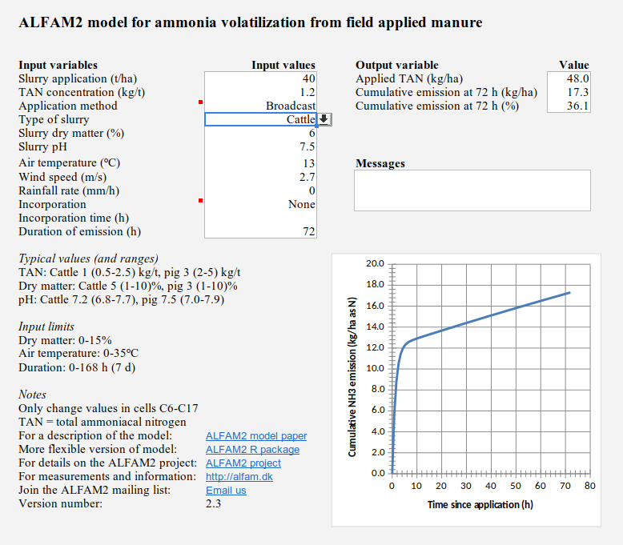

# Objective
The objective is to sort out an apparent inconsistencies in output from the spreadsheet and R package versions of the ALFAM2 model.

# Package 
```{r}
library(ALFAM2)
packageVersion('ALFAM2')
```

# Inputs
Original inputs from Jerome:

```{r}
dat1 <- data.frame(ctime = 72,
                   TAN.app = 48,
                   man.dm = 6,
                   air.temp = 13,
                   wind.2m = 2.7,
                   man.ph = 7.5,
                   app.mthd.bc = TRUE,
                   incorp.deep = FALSE,
                   incorp.shallow = FALSE,
                   rain.rate = 0,
                   man.source.pig = FALSE)
```

Add application rate:

```{r}
dat2 <- data.frame(ctime = 72,
                   TAN.app = 48,
                   app.rate.ni = 40,
                   man.dm = 6,
                   air.temp = 13,
                   wind.2m = 2.7,
                   man.ph = 7.5,
                   app.mthd.bc = TRUE,
                   incorp.deep = FALSE,
                   incorp.shallow = FALSE,
                   rain.rate = 0,
                   man.source.pig = FALSE)
```

Simpler equivalent alternative (because some inputs are at default levels):

```{r}
dat3 <- data.frame(ctime = 72,
                   TAN.app = 48,
                   app.rate.ni = 40,
                   man.dm = 6,
                   air.temp = 13,
                   wind.2m = 2.7,
                   man.ph = 7.5,
                   app.mthd.bc = TRUE,
                   rain.rate = 0)
```

Even simpler if there are more categorical inputs:

```{r}
dat4 <- data.frame(ctime = 72,
                   TAN.app = 48,
                   app.rate.ni = 40,
                   man.dm = 6,
                   air.temp = 13,
                   wind.2m = 2.7,
                   man.ph = 7.5,
                   app.mthd = 'broadcast', # Or 'bc'
                   rain.rate = 0)
```

# Compare predictions
```{r}
alfam2(dat1, time.name = 'ctime')
```

Compare to Excel model v2.3 with default inputs:



Right, these do not match.
The difference is in `app.rate.ni` (slurry application rate, but *n*ot for *i*njection).
These should both match the Excel version:

```{r}
alfam2(dat2, time.name = 'ctime')
alfam2(dat3, time.name = 'ctime')
```

To use `dat4` with package v3.17 you need the `prep` argument.

```{r}
alfam2(dat4, time.name = 'ctime', prep = TRUE)
```

This changes in the new version of the R package, where the `prepDat` argument is `TRUE` by default.
You can get it with:

```{r, eval=FALSE}
remove.packages('ALFAM2')
devtools::install_github("sashahafner/ALFAM2", ref = 'dev', build_vignettes = TRUE)
```

With that you could use:

```{r, eval = FALSE}
alfam2(dat4, time.name = 'ctime')
```


